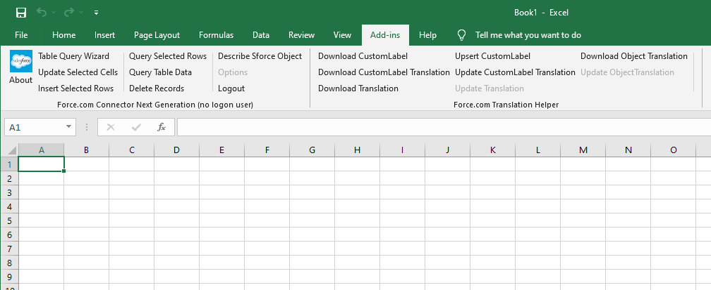

# Force.com Connector
It is a .Net version of existing Excel Connector.
And, I am not a expert of VB.Net, so just ported VBA to VB.Net.

## What are different with Excel Connector
 * Support latest API version
 * Using API name for fields mapping, not labels
 * Add Translation Helper for multilingual environment

## How to use...
[Wiki Page](https://github.com/good-ghost/ForceConnector/wiki) will be updated.

## SObject Related Features
* ... to be updated...
* **Describe Sforce Object**
  * It will be create the sheet(s) about sObject fields and specifications with translations

## Translation Helper
* **Download CustomLabel**
  * Download Custom Labels using Metadata API
  * You can add at least one Custom Label via Web UI and try to download

* **Download CustomLabel Translation**
  * Download translations for Custom Labels using Metadata API
  * Before this action, you must download Custom Labels first
  * Your org have to configure for translation

* **Upsert CustomLabel**
  * You can create or update Custom Label(s)
  * Select the label(s) and click the command button

* **Update CustomLabel Translation**
  * You can update(add) only one language at a time
  * Select the translated label(s) and click the command button

* **Download Object Translation**
  * You can download translations for sObject, fields and related
  * Not for all standard sObject data, only include renamed labels

* **Download Translation**
  * You can download translations for Custom Tab, Flow, QuickAction ...etc

* **Update Object Translation**
  * Currently disabled. Lack of coding about parser (build XML hierarchy)

* **Update Translation**
  * Currently disabled. Lack of coding about parser (build XML hierarchy)

## To do
 * Performance tuning
 * Currently used many similar backgroundworker modal, need to refactoring.
 
## Requirement for build
 * Visual Studio 2019 Community or above
 * .Net Framework 4.7.2
 * Office Developer Tools for Visual Studio (VSTO)
 * [Microsoft Visual Studio Installer Projects](https://marketplace.visualstudio.com/items?itemName=VisualStudioClient.MicrosoftVisualStudio2017InstallerProjects)

 